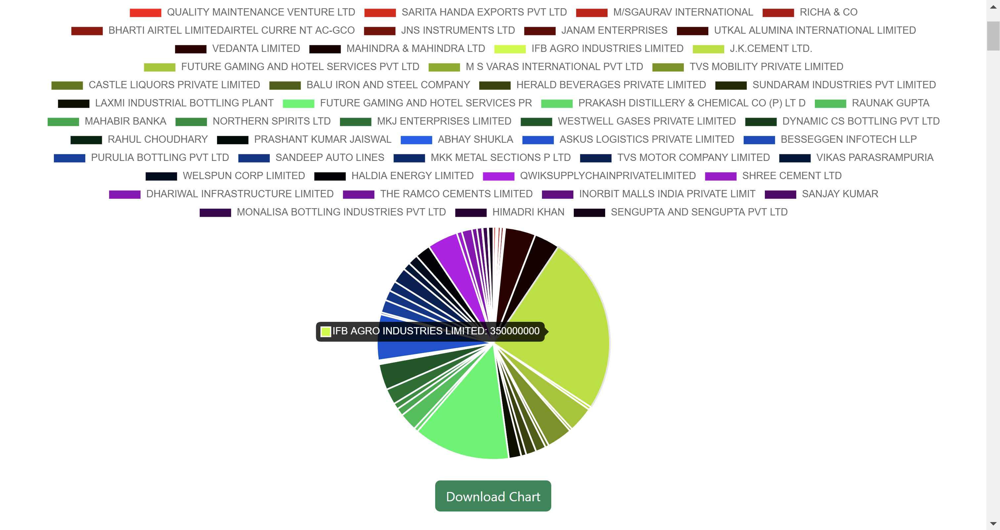
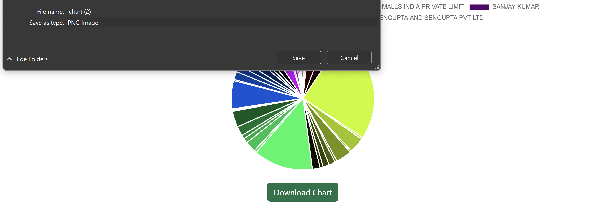
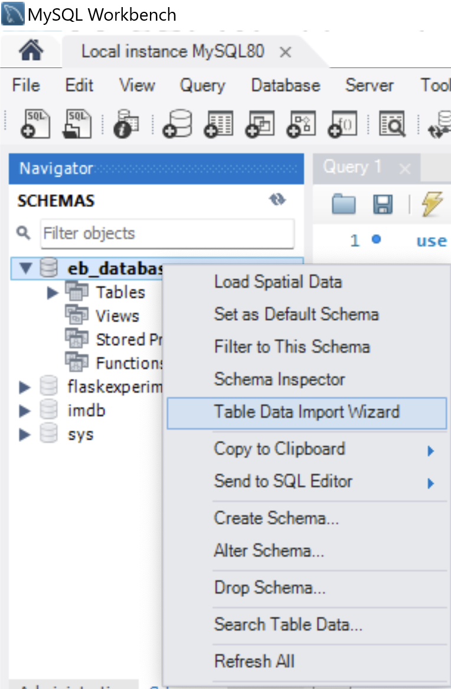

# es113-flask-data-explorer
Devansh Lodha \
23110091
## Answers to all questions asked in 1e
### 1e1
Implement a robust search functionality that allows users to quickly
search for specific records based on Bond Number or filter data based on any column in the table except Sr. No. and Status (e.g., date, political party, company name). The output should be displayed in the form of a table which is fetched from the database for a given query.
#### Steps
1. Go to Search Tab 
.png)
2. Enter Bond Number and Select Details to Display 
.png)
3. Click on Submit, to get the results
.png)

### 1e2
The option to select a Company/Individual from a drop-down/search, and show how many bonds and the total value of bonds purchased per year. You can present a bar plot depicting your results.
#### Steps
1. Go to Company/Individual Stats Tab 
.png)
2. Enter a Company Name
.png)
3. Click on submit to get the results
.png)

### 1e3
The option to select a political party from a drop-down/search, and show how many bonds and total value per year are in the timeline. You can present a bar plot depicting your results.
#### Steps
1. Go to Political Party Stats
.png)
2. Enter name of a Political Party
.png)
3. Click on Submit to get the results
.png)

### 1e4
The option to select a political party from a drop-down/search, shows which companies have donated to it and what amount individually and combined.
#### Steps
1. Go to the Party Donation Stats Page
.png)
2. Enter name of a Political Party
.png)
3. Click on Submit to get the results
.png)
_output is truncated_

### 1e5
Similarly, provide an option to select a company from a drop-down/search, showcasing which parties they have donated and what amount individually and combined.
#### Steps
1. Go to the Company/Individual Donation Stats Page
.png)
2. Enter Company/Individual Name
.png)
3. Click on Submit to get the results
.png)

### 1e6
Pie Charts are displayed

## Downloadable Plots!
1. Generate a chart on any relevant page

2. Click on the Download Chart button and the download window on your system will pop up

3. Save to any directory and open the png
.png)
## Instructions to set up the website locally
1. Download the zip file of this repository
2. Unzip it to a folder
3. Open Visual Studio Code
4. Open the previously unzipped folder in VSCode
5. Open the terminal (powershell for windows) and enter the following to set up a virtual environment:
```bash
python -m venv flask_env
```
```bash
./flask_env/Scripts/activate.ps1
```
6. Install the dependencies in the virtual environment
```bash
pip install flask flask-mysqldb wtforms pyyaml
```
7. Open MySQL work bench
8. Create a new database `eb_database`
9. Right click on the database under the schemas in the left column and select Table Data Import Wizard

10. Select the file path to `purchase_details.csv` in the `pdf_to_csv` folder of this repo
11. Follow the steps to import the csv file. Set the datetime format accordingly.
12. Repeat the same steps for `redemption_details.csv`
13. Run the following queries:
```mysql
use  eb_database;

ALTER TABLE purchase_details
RENAME COLUMN Prefix to `Purchase Prefix`;

ALTER TABLE redemption_details
RENAME COLUMN Prefix to `Redemption Prefix`;

ALTER TABLE purchase_details
RENAME COLUMN Denominations to `Purchase Denominations`;

ALTER TABLE redemption_details
RENAME COLUMN Denominations to `Redemption Denominations`;
```
14. The database is now set up.
15. Inside of `db.yaml` back in VSCode, make sure details are correct according to the password set by you.
16. Go to the terminal again and enter the following (this may defer for terminals that are not powershell):
```bash
$env:FLASK_APP = "app"
```
17. Run the app
```bash
python -m flask run
```
17. Open the localhost link shown in your terminal in a browser to access the app

## Bonus Feature: Alluvial Diagram to show Flow of Money
_chart has not rendered completely due to processing limitations_
